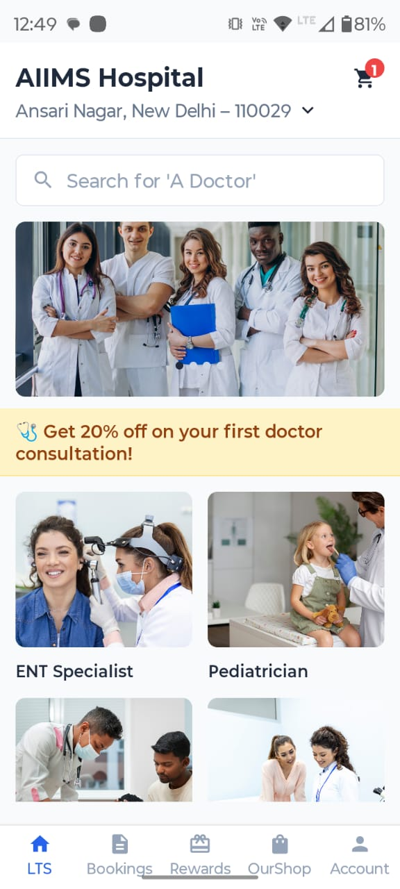
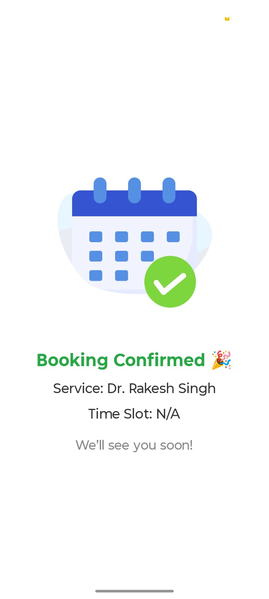
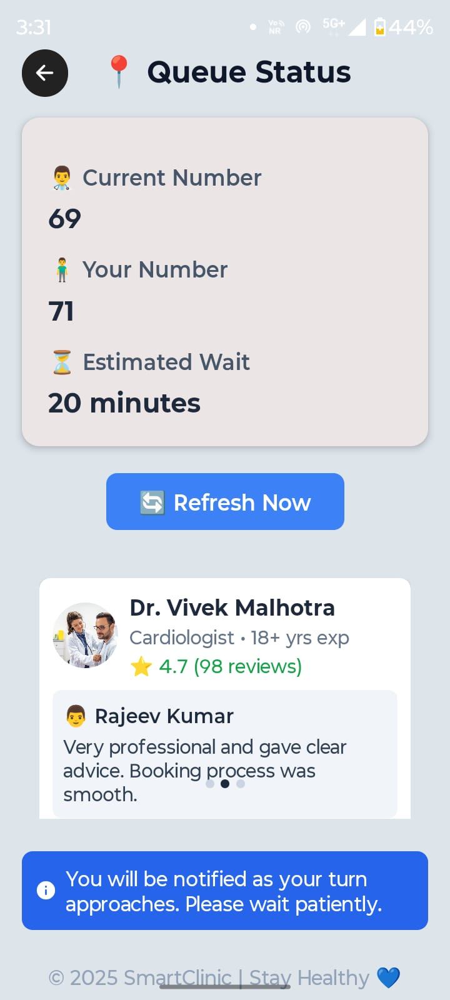
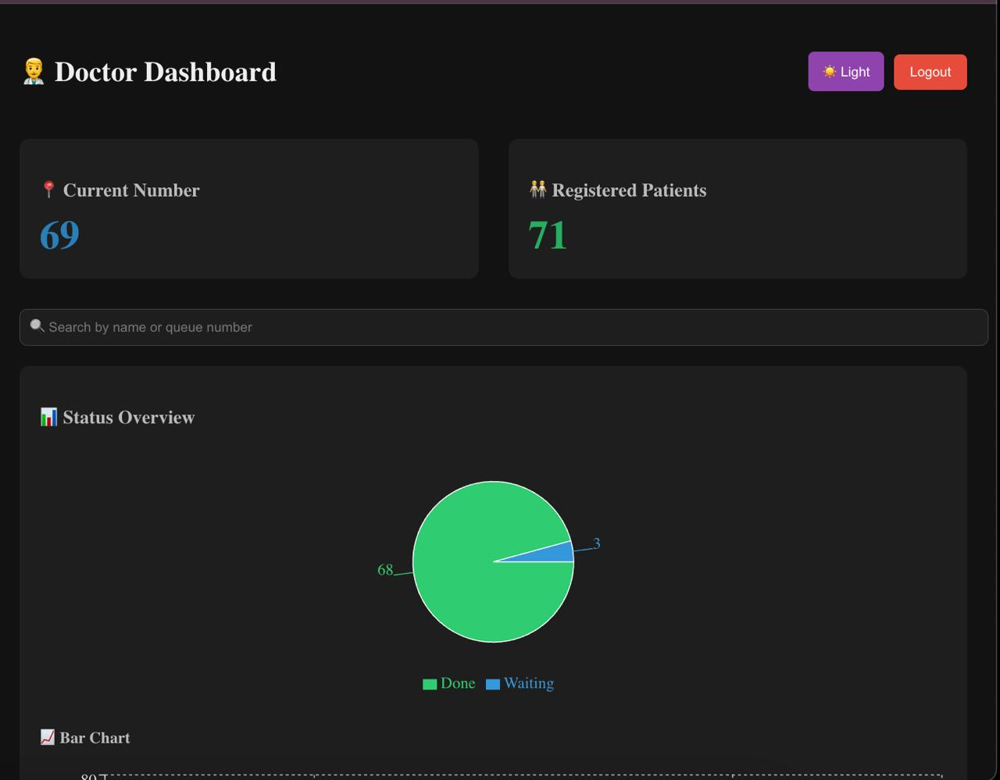
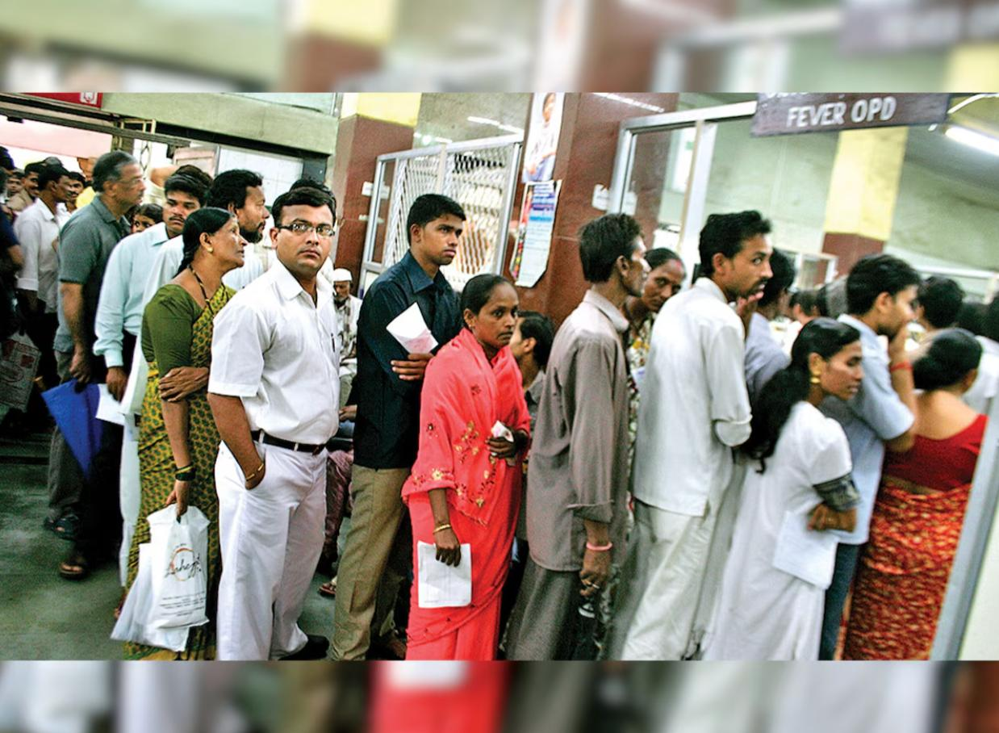
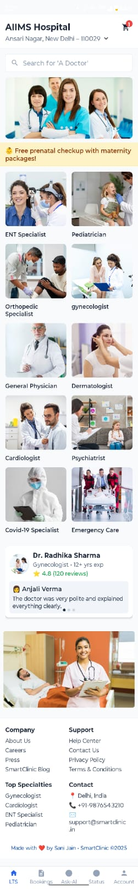
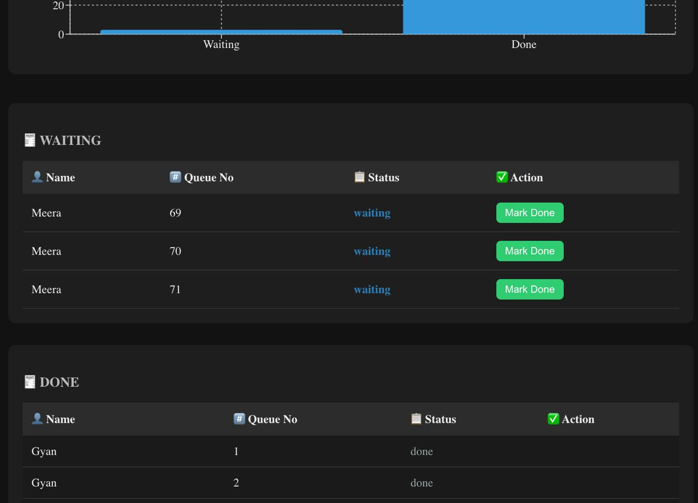

 🩺 Real-Time Patient Queue Management System

A modern, scalable, and real-time digital solution to replace physical queues in hospitals, clinics, and service centers — built using **Django REST Framework**, **React Native**, **React.js**, and **WebSockets**.

---

## 🚀 Overview

Patients often wait for hours in hospitals without knowing their actual turn, which leads to:

- 😣 Stress & discomfort  
- 👥 Overcrowding  
- ❓ Repeated inquiries at reception  
- ⭐ Poor patient experience  

This project solves the problem using a **real-time queue tracking system** where:

- Patients register remotely using a mobile app  
- Doctors manage the queue through a dashboard  
- Everyone receives real-time token updates & ETA  

---

## 📸 Demo Screenshots

### 📱 Patient Mobile App

<p align="center">
  
  
  
</p>

---

### 🧑‍⚕️ Doctor Dashboard

<p align="center">
  
</p>

---

### 🏥 Real World Problem (Before vs After)

<p align="center">
  
  
</p>

<p align="center">
  <b>Traditional Hospital Queue</b> ❌ &nbsp;&nbsp;vs&nbsp;&nbsp; <b>Smart Digital Queue</b> ✅
    
</p>

---

## 🏗️ System Architecture

### 1️⃣ Patient Mobile App (React Native)
- Remote registration  
- Live token & ETA tracking  
- Push / real-time updates
-    

### 2️⃣ Doctor Dashboard (React.js)
- Queue control (Next, Skip, Complete)  
- Live patient list  
- Status analytics
-    

### 3️⃣ Backend (Django REST Framework)
- Authentication (Patients & Doctors)  
- Token & queue management logic  
- Secure APIs
-   

### 4️⃣ Real-Time Layer
- WebSockets (Django Channels)  

### 5️⃣ Database
- PostgreSQL / SQLite3  

---

## 🔧 Tech Stack

### Frontend
- React Native (Patient App)
- React.js (Doctor Dashboard)

### Backend
- Python
- Django REST Framework
- Django Channels

### Database
- PostgreSQL / SQLite3

### Notifications (Optional)
- Push / SMS

---

## ⭐ Key Features

- ✅ Remote patient registration  
- ✅ Real-time token number & ETA  
- ✅ Multi-doctor & multi-clinic support  
- ✅ Doctor queue control dashboard  
- ✅ Reduced physical waiting  
- ✅ Scalable & modular architecture  

---

## 🛠️ Installation & Setup

### 1️⃣ Clone the Repository

```bash
git clone https://github.com/sanij0579/Doctor-patient-Queue-app.git
cd Doctor-patient-Queue-app
2️⃣ Backend Setup (Django):

cd backend
pip install -r requirements.txt
python manage.py migrate
python manage.py runserver


Backend will run at:
http://127.0.0.1:8000/

3️⃣ Mobile App Setup (React Native)

cd mobile-app
npm install
npm start

4️⃣ Doctor Dashboard Setup (React.js)

cd doctor-dashboard
npm install
npm start

Dashboard runs at:
http://localhost:3000/

📡 API Overview
🔐 Authentication

POST /api/register/ – Patient registration

POST /api/login/ – Patient login

POST /api/doctor/login/ – Doctor login

🔄 Queue Management

POST /api/queue/join/ – Take token

GET /api/queue/current/ – Get current token

POST /api/queue/next/ – Move to next patient

POST /api/queue/skip/ – Skip patient


📊 Impact & Benefits
⬇ 40% reduction in physical waiting time

⬇ 25% fewer reception inquiries

⭐ Improved patient satisfaction

🏥 Smoother hospital operations

🔮 Future Enhancements
🤖 AI-based wait time prediction

🔊 Voice announcements (local languages)

🧾 EMR / Hospital system integration

👤 Role-based permissions

📈 Advanced analytics & reports

🤝 Contributing
Contributions are welcome!
Feel free to open issues, submit pull requests, or suggest improvements.

📝 License
This project is licensed under the MIT License.

🎯 Goal
To make healthcare faster, smarter, and more patient-friendly — one queue at a time.

---

